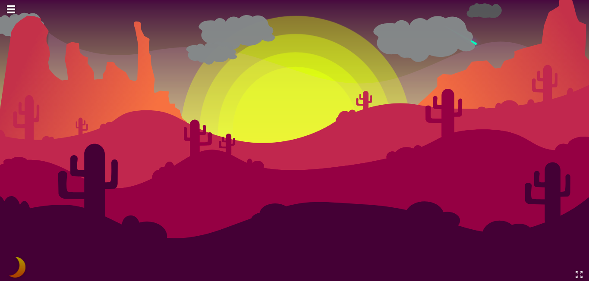

 <h1 align="center">Titan Beats</h1>


[](http://makeapullrequest.com) 

Audio visualizer

<a href="https://titan-beats.herokuapp.com" target="_blank">




## Contributors

1. Clone the Repo

```sh
git clone https://github.com/Serjeel-Ranjan-911/Titan-Beats.git
```

2. Install Packages

```sh
npm i
```

3. Starting Node Server

```sh
npm start
```

4. Open broswer at 127.0.0.1:3000

### For development

run this single command

```sh
npm run dev
```

This will start a backend server while monitoring all the sass files.

### Before making a pull request

1. Properly naming your branch

    "issue-"+"issue number"+"purpose"

eg. issue-30-fix-theme-btn

commit the changes to your created branch

2. Dont't forget to [link pull request to the issue](https://docs.github.com/en/enterprise-server@2.21/github/managing-your-work-on-github/linking-a-pull-request-to-an-issue).

eg. fixes #30


<hr>

**Note:**

The App currently serves music from server.  
Special thanks to [Pixabay](www.pixabay.com).

<hr>

<p align="center">
  
</p>

Happy Coding!